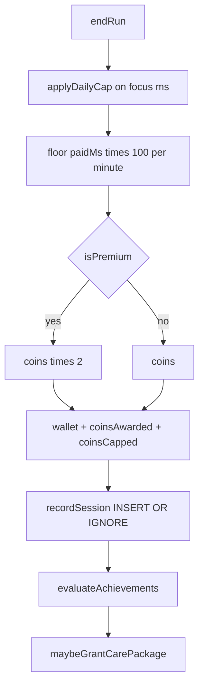

# Big-number economy — implementation plan

Living spec for the coin economy, shop vs prestige split, and Capy Club.
Product rationale lives here so future changes do not re-open locked decisions.
Execute **in phase order**. Do not start Phase 3 until Phase 1 tests pass.

Related: App Store / Shipaton blockers still in [README.md](../README.md) (RevenueCat keys, privacy policy, EAS). This doc does not replace that checklist.

---

## Locked decisions (do not bikeshed)

1. **100 coins per focus minute** (`Math.floor(focusMs * 100 / 60000)`). Break and prep pay 0.
2. **Daily cap is time, not coins:** 3 hours of *paid focus ms* per local day. Club 2x does not enlarge the cap.
3. **Bifurcated rewards:**
   - `earn: 'shop'` — coins and IAP.
   - `earn: 'achievement'` — lifetime hours or behavior only. Never coins, never IAP.
   - `earn: 'club-drop'` — calendar Care Package only.
4. **`unlockCompanion` refuses non-shop ids.** IAP only calls `addCoins`. The shop UI never shows a price on achievement skins.
5. **No Legendary coin pack.** No `capycoins_4380000` / $59.99 SKU.
6. **Club 2x never multiplies lifetime focus hours.** Prestige clocks are wall-clock focus in SQLite.
7. **Care Package = calendar month, grant immediately** when `premium` is active that month. Unsubscribe: keep granted drops; lose 2x, crown, future drops.
8. **Club copy leads with utility** (tags, timers, analytics, crown, drops), not 2x or “unlock skins faster.”
9. **New installs start at 0 coins.** Persist migrate v1 → v2: `wallet.coins *= 100`.
10. **Apple IAP floor is $0.99.** No $0.10 “skip 1 hour” product.

---

## Economy tables

Assume a strong free user: **2h focus / day**. Display coins are 100× the old “1 coin/minute” table.

### Shop (buyable)

| Id | Skin | `priceCoins` | ~Free 2h/day | IAP |
|---|---|---|---|---|
| `basic` | Basic Capy | 0 (unlocked) | — | — |
| `egg` | Egg Capy | 6,000 | Day 1 | earn only |
| `toilet` | Toilet Capy | 84,000 | Week 1 | `capycoins_84000` $0.99 |
| `fighting` | Fighting! Capy | 360,000 | Month 1 | `capycoins_360000` $4.99 featured |
| `avocado` | Avocado Capy | 1,080,000 | Month 3 | `capycoins_1080000` $14.99 |

### Prestige hour ladder (unbuyable)

| Id | Lifetime `SUM(focus_ms)` | ~Free 2h/day |
|---|---|---|
| `hours_1` | 1h | Day 1 |
| `hours_14` | 14h | Week 1 |
| `hours_60` | 60h | Month 1 |
| `hours_180` | 180h | Month 3 |
| `hours_730` / `legendary` | 730h | Year 1 |

### Behavior skins (unbuyable)

| Id | Rule |
|---|---|
| `zombie` | 100h focus with local `startedAt` hour in 0–3 |
| `zen` | 30 consecutive local days with ≥1 session |
| `scholar` | 500h focus on categories named Study or Deep Work |
| `marathon` | one session `skipped = 0` and `focusMs >= 4h` |
| `touch-grass` | ≥12h focus in any rolling 24h window; unlock + gentle nudge copy |

### Capy Club SKUs

| Product id | Price | Entitlement |
|---|---|---|
| `capyclub_monthly` | $4.99/mo | `premium` |
| `capyclub_annual` | $39.99/yr | `premium` |

---

## Data flow after a run ends

---

## Phase 1 — Math, cap, shop catalogue

**Goal:** economy numbers and daily cap are real. Shop cannot buy prestige. No new UI except cap copy if `coinsCapped`.

### Files

- [ ] [`src/store/types.ts`](../src/store/types.ts) — `COINS_PER_FOCUS_MINUTE = 100`; keep `applyDailyCap` using whole paid minutes against the 3h ms budget.
- [ ] [`src/store/index.ts`](../src/store/index.ts)
  - `Companion` gets `earn: 'shop' | 'achievement' | 'club-drop'`.
  - `DEFAULT_COMPANIONS`: shop rows with new prices; avocado as shop; achievement ids with `priceCoins: 0`, `unlocked: false`, `earn: 'achievement'`.
  - Persist `paidFocusMsToday`, `paidFocusDay`, `coinsCapped`.
  - `endRun` uses `applyDailyCap` then optional 2x **only if** `isPremium` (2x can land in Phase 4; Phase 1 may multiply by 1).
  - `unlockCompanion`: return false unless `earn === 'shop'`.
  - persist `version: 2` + `migrate`: `coins * 100`; refresh shop `priceCoins` from catalogue; do not copy prices onto achievement ids.
  - New default `wallet.coins = 0`.
- [ ] [`src/purchases/products.ts`](../src/purchases/products.ts) — three packs only (`capycoins_84000`, `capycoins_360000` featured, `capycoins_1080000`).
- [ ] [`README.md`](../README.md) — IAP ids and prices.
- [ ] [`app/index.tsx`](../app/index.tsx) — hide Buy on non-shop companions; show “Earned, not sold” (can be copy-only until Phase 3 UI).
- [ ] Completion line when `coinsCapped`.

### Tests

- [ ] [`__tests__/timer.test.ts`](__tests__/timer.test.ts) — 40 focus min → 4,000 coins (uncapped, not Club). Cap: >3h paid focus in one local day stops paying extra coins; history still records full `focusMs`.
- [ ] Add `applyDailyCap` unit cases (rollover at local midnight).
- [ ] [`__tests__/purchases.test.ts`](__tests__/purchases.test.ts) / [`__tests__/iap.test.tsx`](__tests__/iap.test.tsx) — new product ids.
- [ ] Unlock tests: cannot spend coins on `hours_1` / `zombie`.

### Done when

`npx tsc --noEmit && npm test` pass. Leaving a timer overnight cannot print Avocado. Egg costs 6,000.

---

## Phase 2 — Session-complete tick-up

**Goal:** dopamine on the number, wallet pill does not jump first.

### Files

- [ ] [`app/index.tsx`](../app/index.tsx) `CompletionState` — Reanimated 0 → `coinsAwarded` in 800–1200ms, ease-out. Title: `Session Complete! +{n} Coins!`
- [ ] Defer header [`CoinWallet`](../components/capy/CoinWallet.tsx) until the counter finishes (local state or delay applying displayed wallet).
- [ ] Optional chip `Capy Club ×2` only if `isPremium` (no-op until Phase 4).

### Tests

- [ ] Component test: ended state eventually shows the full `coinsAwarded` string.

### Done when

A 20 min focus shows the digits rolling to +2,000 (or +4,000 with Club later).

---

## Phase 3 — Achievements

**Goal:** hour ladder + behavior skins grant from SQLite after each recorded session.

### Files

- [ ] New [`src/db/achievements.ts`](../src/db/achievements.ts) — pure functions over `Session[]` + categories; return ids to unlock.
- [ ] Call from `endRun` / `recordSession` success path (idempotent `unlocked: true`).
- [ ] [`src/db/categories.ts`](../src/db/categories.ts) — seed Study and Deep Work if missing (scholar).
- [ ] Carousel: achievement skins visible, locked until grant; no coin price.
- [ ] Placeholder frames until Figma; silhouette OK. Map `touch-grass` to avocado art only if you explicitly want a nature stand-in; default is placeholder.

### Tests

- [ ] Synthetic sessions: 1h total unlocks `hours_1` only; 730h unlocks legendary; marathon one 4h unskipped row; zen 30 days; touch-grass 12h in 24h; scholar 500h on Study.

### Done when

A user who never opens IAP can still earn `hours_1` on day 1 and can never buy `hours_730`.

---

## Phase 4 — Capy Club

**Goal:** subscription is utility. 2x is a footnote.

### Files

- [ ] RevenueCat dashboard (manual): attach `capyclub_monthly` / `capyclub_annual` to entitlement `premium`. App: offerings or a dedicated purchase path in [`app/iap.tsx`](../app/iap.tsx) (Club section above coin packs).
- [ ] [`src/store/index.ts`](../src/store/index.ts) `endRun` — after cap, `coins *= isPremium ? 2 : 1`.
- [ ] [`components/capy/CapyMascot.tsx`](../components/capy/CapyMascot.tsx) — crown overlay iff `isPremium`.
- [ ] Free-tier caps (today everything is already unlimited — **add** caps so Club is honest):
  - e.g. 3 categories
  - stats window last 30 days for free; Club = all history
  - custom loops / durations: free preset set; Club = full sliders
- [ ] Care Package table `month 1–12 → companionId` (`earn: 'club-drop'`). On `syncPremium` and on launch: if Club and `lastCarePackageMonth !== YYYY-MM`, unlock that month’s drop and persist the key.
- [ ] Paywall strings: utility first.

### Tests

- [ ] Club user: same focus ms → 2× coins vs free; hour achievements unchanged.
- [ ] Lapsed Club: crown gone; drops already unlocked stay unlocked.
- [ ] Mid-month subscribe in October grants October drop without waiting for renewal.

### Done when

A sandbox subscriber gets crown + 2x coins + this month’s drop the same day, and `hours_730` still requires 730h.

---

## Phase 5 — Stores (ops, not just code)

- [ ] App Store Connect + Play Console: three consumable coin products + two subscriptions. **No** legendary consumable.
- [ ] RevenueCat: default offering contains those five products; entitlement `premium` on both Club SKUs.
- [ ] `EXPO_PUBLIC_REVENUECAT_IOS_KEY` / `ANDROID_KEY` in EAS secrets. Never `EXPO_PUBLIC_FORCE_PREMIUM` on production.
- [ ] Consumable fulfillment: credit wallet once per store transaction id (crash-safe). Restore stays honest for coins.
- [ ] Privacy policy URL, support URL, `ios.appleTeamId`, EAS production, TestFlight.
- [ ] Submit ≥1 week before Shipaton deadline (store review).

Ship **without** all Figma achievement arts. Do not block on 12 monthly drop illustrations.

---

## Out of scope

- Fractional coins on screen.
- Server-side wallet / accounts.
- Club 2x on lifetime hours.
- OneSignal, Layers, Kotlin Multiplatform, Replit Agent.

---

## Implementation order for an agent

1. Phase 1 (numbers + cap + migrate + tests).
2. Phase 2 (tick-up).
3. Phase 3 (SQLite achievements).
4. Phase 4 (Club + free caps + Care Package).
5. Phase 5 (human: dashboards, EAS, listing).

Gate every code phase with `npx tsc --noEmit && npm test` per [CLAUDE.md](../CLAUDE.md).
